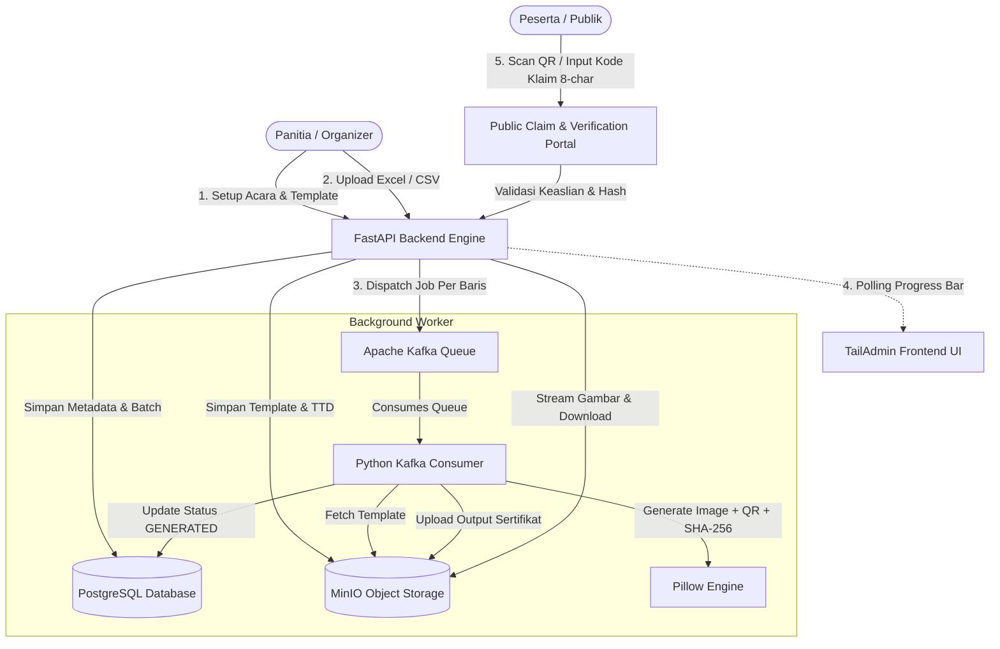

# Secure Cert Flow - Automated Certificate Generator MVP 📜⚡

**Secure Cert Flow** adalah sistem otomasi pembuatan (*bulk generation*), distribusi, dan verifikasi sertifikat digital anti-pemalsuan (*fraud-proof*) berbasis Web. Platform ini dirancang untuk panitia acara, konferensi ilmiah, seminar, dan webinar dengan kemampuan menangani ribuan penerima secara asinkron menggunakan antrean **Apache Kafka**, penyimpanan berkas **MinIO (S3 Compatible)**, basis data relasional **PostgreSQL**, antarmuka modern **TailAdmin (Tailwind CSS)**, dan arsitektur deployment otomatis **CI/CD Webhooks**.

---

## 🏛️ 1. Arsitektur Sistem



---

## 📂 2. Struktur Direktori Backend Python

```text
/var/www/sertifikat/
├── app/
│   ├── __init__.py                  # Inisialisasi package backend
│   ├── config.py                   # Pydantic Settings & Environment Variables
│   ├── database.py                 # SQLAlchemy 2.0 Engine & Session Local
│   ├── main.py                     # FastAPI Application, Lifespan, CORS & Routes
│   ├── api/
│   │   ├── __init__.py
│   │   ├── deps.py                 # Dependency Injection (Auth, JWT, DB Session)
│   │   └── v1/
│   │       ├── __init__.py         # Router Aggregator v1
│   │       ├── auth.py             # Register, Login, Email Verification
│   │       ├── events.py           # CRUD Event Management
│   │       ├── templates.py        # Visual Coordinate Placement & Uploads
│   │       ├── bulk.py             # Excel/CSV Parser & Kafka Producer Dispatch
│   │       ├── certificates.py     # Organizer Certificate Management
│   │       ├── claim.py            # Public 8-char Claim & QR Anti-Fraud Verification
│   │       └── webhooks.py         # CI/CD GitHub Webhook (HMAC SHA-256)
│   ├── models/                     # SQLAlchemy ORM Models
│   │   ├── __init__.py
│   │   ├── user.py                 # Users Table
│   │   ├── event.py                # Events Table
│   │   ├── template.py             # Templates & Dynamic Fields Table
│   │   ├── batch.py                # Batches Table
│   │   ├── participant.py          # Participants Table
│   │   ├── certificate.py          # Certificates Table
│   │   └── webhook.py              # Webhook Logs Table
│   ├── schemas/                    # Pydantic Request & Response Validation
│   │   ├── __init__.py
│   │   ├── auth.py
│   │   ├── event.py
│   │   ├── template.py
│   │   ├── batch.py
│   │   ├── participant.py
│   │   ├── certificate.py
│   │   └── claim.py
│   ├── services/                   # Business Logic & Infrastructure Layer
│   │   ├── __init__.py
│   │   ├── auth_service.py         # Passlib Bcrypt & JWT Token Manager
│   │   ├── minio_service.py        # MinIO S3 SDK Wrapper with Resilient Fallback
│   │   ├── kafka_service.py        # Kafka Producer with SASL_PLAINTEXT PLAIN
│   │   ├── cert_generator.py       # High-Res Pillow Rendering + QR Code + SHA-256
│   │   └── excel_service.py        # Pandas/OpenPyXL Parser with Header Aliases
│   └── worker/
│       ├── __init__.py
│       └── kafka_consumer.py       # Standalone Kafka Consumer Background Worker
├── scripts/
│   ├── init_db.sql                 # PostgreSQL DDL Initialization Script
│   ├── run_worker.py               # Worker Daemon CLI Launcher
│   └── deploy_webhook.sh           # Automated CI/CD Webhook Script
├── static/                         # TailAdmin Static Assets (CSS, JS, Images)
├── templates/                      # TailAdmin Integrated HTML Views
│   ├── index.html                  # Landing Page
│   ├── signin.html                 # Login Page
│   ├── signup.html                 # Register Page
│   ├── dashboard.html              # Main Organizer Dashboard
│   ├── claim.html                  # Participant Claim Page
│   └── verify.html                 # Anti-Fraud QR Code Verification Page
├── .env.example                    # Template Environment Variables (No Secrets)
├── .gitignore                      # Strict Git Exclusions
├── requirements.txt                # Python Dependencies
└── README.md                       # Dokumentasi Sistem
```

---

## 🗄️ 3. Database Schema (PostgreSQL DDL)

Struktur tabel dioptimalkan dengan UUID (native `gen_random_uuid()`), index relasional, dan timestamps:

```sql
-- 1. Tabel Users (Panitia / Organizer)
CREATE TABLE users (
    id UUID PRIMARY KEY DEFAULT gen_random_uuid(),
    email VARCHAR(255) UNIQUE NOT NULL,
    hashed_password VARCHAR(255) NOT NULL,
    full_name VARCHAR(255) NOT NULL,
    is_active BOOLEAN DEFAULT TRUE NOT NULL,
    is_verified BOOLEAN DEFAULT FALSE NOT NULL,
    verification_token VARCHAR(255) NULL,
    created_at TIMESTAMPTZ DEFAULT NOW() NOT NULL,
    updated_at TIMESTAMPTZ DEFAULT NOW() NOT NULL
);

-- 2. Tabel Events (Konferensi / Webinar)
CREATE TABLE events (
    id UUID PRIMARY KEY DEFAULT gen_random_uuid(),
    user_id UUID NOT NULL REFERENCES users(id) ON DELETE CASCADE,
    name VARCHAR(255) NOT NULL,
    location VARCHAR(255) NOT NULL,
    event_date DATE NOT NULL,
    description TEXT NULL,
    status VARCHAR(50) DEFAULT 'draft' NOT NULL,
    created_at TIMESTAMPTZ DEFAULT NOW() NOT NULL,
    updated_at TIMESTAMPTZ DEFAULT NOW() NOT NULL
);

-- 3. Tabel Templates (Layout Dasar Sertifikat)
CREATE TABLE templates (
    id UUID PRIMARY KEY DEFAULT gen_random_uuid(),
    event_id UUID UNIQUE NOT NULL REFERENCES events(id) ON DELETE CASCADE,
    background_image_url VARCHAR(1024) NOT NULL,
    width INTEGER DEFAULT 1920 NOT NULL,
    height INTEGER DEFAULT 1080 NOT NULL,
    signature_image_url VARCHAR(1024) NULL,
    signature_x INTEGER NULL,
    signature_y INTEGER NULL,
    signature_width INTEGER NULL,
    signature_height INTEGER NULL,
    qr_x INTEGER NULL,
    qr_y INTEGER NULL,
    qr_size INTEGER DEFAULT 150 NOT NULL,
    qr_base_url VARCHAR(500) DEFAULT '/claim/' NOT NULL,
    cert_number_prefix VARCHAR(50) DEFAULT 'CERT' NOT NULL,
    cert_number_x INTEGER NULL,
    cert_number_y INTEGER NULL,
    cert_number_font_size INTEGER DEFAULT 24 NOT NULL,
    cert_number_color VARCHAR(20) DEFAULT '#1E293B' NOT NULL,
    created_at TIMESTAMPTZ DEFAULT NOW() NOT NULL,
    updated_at TIMESTAMPTZ DEFAULT NOW() NOT NULL
);

-- 4. Tabel Template Fields (Koordinat Parameter Dinamis: nama, peran, judul_paper)
CREATE TABLE template_fields (
    id UUID PRIMARY KEY DEFAULT gen_random_uuid(),
    template_id UUID NOT NULL REFERENCES templates(id) ON DELETE CASCADE,
    field_key VARCHAR(100) NOT NULL,
    label VARCHAR(100) NOT NULL,
    pos_x INTEGER NOT NULL,
    pos_y INTEGER NOT NULL,
    font_family VARCHAR(100) DEFAULT 'DejaVuSans-Bold.ttf' NOT NULL,
    font_size INTEGER DEFAULT 36 NOT NULL,
    font_color VARCHAR(20) DEFAULT '#1E293B' NOT NULL,
    text_align VARCHAR(20) DEFAULT 'center' NOT NULL,
    max_width INTEGER NULL,
    is_required BOOLEAN DEFAULT TRUE NOT NULL,
    created_at TIMESTAMPTZ DEFAULT NOW() NOT NULL,
    CONSTRAINT uq_template_field_key UNIQUE (template_id, field_key)
);

-- 5. Tabel Batches (Monitoring Progress Upload Massal)
CREATE TABLE batches (
    id UUID PRIMARY KEY DEFAULT gen_random_uuid(),
    event_id UUID NOT NULL REFERENCES events(id) ON DELETE CASCADE,
    filename VARCHAR(255) NOT NULL,
    total_records INTEGER DEFAULT 0 NOT NULL,
    processed_records INTEGER DEFAULT 0 NOT NULL,
    success_records INTEGER DEFAULT 0 NOT NULL,
    failed_records INTEGER DEFAULT 0 NOT NULL,
    status VARCHAR(50) DEFAULT 'pending' NOT NULL,
    error_log JSONB DEFAULT '[]'::jsonb NOT NULL,
    created_at TIMESTAMPTZ DEFAULT NOW() NOT NULL,
    updated_at TIMESTAMPTZ DEFAULT NOW() NOT NULL
);

-- 6. Tabel Participants (Penerima Sertifikat)
CREATE TABLE participants (
    id UUID PRIMARY KEY DEFAULT gen_random_uuid(),
    event_id UUID NOT NULL REFERENCES events(id) ON DELETE CASCADE,
    batch_id UUID NULL REFERENCES batches(id) ON DELETE SET NULL,
    email VARCHAR(255) NOT NULL,
    name VARCHAR(255) NOT NULL,
    role VARCHAR(100) NOT NULL,
    paper_title TEXT NULL,
    custom_data JSONB DEFAULT '{}'::jsonb NOT NULL,
    created_at TIMESTAMPTZ DEFAULT NOW() NOT NULL
);

-- 7. Tabel Certificates (Sertifikat Hasil Terbit & Anti-Fraud)
CREATE TABLE certificates (
    id UUID PRIMARY KEY DEFAULT gen_random_uuid(),
    event_id UUID NOT NULL REFERENCES events(id) ON DELETE CASCADE,
    participant_id UUID NOT NULL REFERENCES participants(id) ON DELETE CASCADE,
    batch_id UUID NULL REFERENCES batches(id) ON DELETE SET NULL,
    certificate_number VARCHAR(100) UNIQUE NOT NULL,
    claim_code VARCHAR(16) UNIQUE NOT NULL,
    pdf_url VARCHAR(1024) NULL,
    image_url VARCHAR(1024) NULL,
    checksum_sha256 VARCHAR(64) NULL,
    status VARCHAR(50) DEFAULT 'PENDING' NOT NULL,
    error_message TEXT NULL,
    claimed_at TIMESTAMPTZ NULL,
    download_count INTEGER DEFAULT 0 NOT NULL,
    created_at TIMESTAMPTZ DEFAULT NOW() NOT NULL,
    updated_at TIMESTAMPTZ DEFAULT NOW() NOT NULL
);

-- 8. Tabel Webhook Logs (Audit Trail CI/CD)
CREATE TABLE webhook_logs (
    id UUID PRIMARY KEY DEFAULT gen_random_uuid(),
    event_type VARCHAR(100) NOT NULL,
    payload JSONB NOT NULL,
    status VARCHAR(50) NOT NULL,
    response_message TEXT NULL,
    created_at TIMESTAMPTZ DEFAULT NOW() NOT NULL
);
```

---

## ⚙️ 4. Konfigurasi Koneksi (Environment Variables)

Salin template file `.env.example` menjadi `.env` lalu sesuaikan kredensial:

```bash
cp .env.example .env
```

Isi parameter konfigurasi pada `.env`:

```ini
# App Server
APP_NAME=SecureCertFlow
APP_ENV=development
APP_DEBUG=true
APP_HOST=0.0.0.0
APP_PORT=8000
APP_BASE_URL=http://localhost:8000

# Security & JWT
JWT_SECRET_KEY=ganti_dengan_kunci_rahasia_jwt_minimal_32_karakter
JWT_ALGORITHM=HS256
ACCESS_TOKEN_EXPIRE_MINUTES=1440

# PostgreSQL Database
POSTGRES_HOST=10.88.0.7
POSTGRES_PORT=5432
POSTGRES_USER=postgres
POSTGRES_PASSWORD=your_postgres_password
POSTGRES_DB=postgres
POSTGRES_SCHEMA=certflow

# MinIO S3 Compatible Storage
MINIO_ENDPOINT=10.88.0.11:9000
MINIO_SECURE=false
MINIO_ACCESS_KEY=admin
MINIO_SECRET_KEY=your_minio_secret_key
MINIO_BUCKET_TEMPLATES=cert-templates
MINIO_BUCKET_CERTIFICATES=cert-outputs
MINIO_BUCKET_SIGNATURES=cert-signatures

# Apache Kafka Message Broker
KAFKA_BOOTSTRAP_SERVERS=10.88.0.7:9092
KAFKA_SECURITY_PROTOCOL=SASL_PLAINTEXT
KAFKA_SASL_MECHANISM=PLAIN
KAFKA_SASL_USERNAME=admin
KAFKA_SASL_PASSWORD=your_kafka_password
KAFKA_TOPIC_CERT_GENERATION=cert_generation_queue
KAFKA_CONSUMER_GROUP=cert_generation_workers

# CI/CD Webhook
WEBHOOK_SECRET=your_github_webhook_secret
```

---

## 🚀 5. Panduan Instalasi & Menjalankan Aplikasi

### A. Persiapan Virtual Environment
```bash
cd /var/www/sertifikat
python3 -m venv .venv
source .venv/bin/activate
pip install -r requirements.txt
```

### B. Inisialisasi Database Schema
```bash
python3 -c "
from app.database import engine, Base
from app.models import *
Base.metadata.create_all(bind=engine)
print('Database tables verified!')
"
```

### C. Menjalankan Backend API Server (FastAPI)
```bash
source .venv/bin/activate
uvicorn app.main:app --host 0.0.0.0 --port 8000 --reload
```
Akses di browser:
- **Interactive Swagger Docs**: [http://localhost:8000/docs](http://localhost:8000/docs)
- **Organizer Dashboard**: [http://localhost:8000/dashboard](http://localhost:8000/dashboard)
- **Public Claim Portal**: [http://localhost:8000/claim](http://localhost:8000/claim)

### D. Menjalankan Kafka Background Consumer Worker
Jalankan worker di terminal terpisah atau via systemd/supervisor:
```bash
source .venv/bin/activate
python scripts/run_worker.py
```

---

## 🎨 6. Integrasi Frontend TailAdmin

Frontend TailAdmin diintegrasikan pada direktori `/var/www/sertifikat/`:
1. **`static/`**: Berisi seluruh file CSS kustom, JavaScript komponen chart/datepicker, dan gambar aset TailAdmin.
2. **`templates/`**:
   - `signin.html` & `signup.html`: Autentikasi panitia terhubung langsung dengan JWT token API.
   - `dashboard.html`: Dashboard lengkap dengan modul Manajemen Acara, Visual Coordinate Designer, Bulk Excel Uploader dengan Live Kafka Progress Bar, dan Tabel Sertifikat Terbit.
   - `claim.html`: Halaman publik bagi peserta untuk memasukkan 8 karakter kode klaim unik.
   - `verify.html`: Halaman verifikasi anti-fraud hasil pemindaian QR code yang memverifikasi keaslian via SHA-256 checksum.

---

## 🔄 7. CI/CD Webhook Deployment Architecture

Aplikasi telah dilengkapi endpoint webhook di `/api/v1/webhooks/github` yang memverifikasi tanda tangan `X-Hub-Signature-256`. 

Saat ada push baru ke branch `main`:
1. GitHub mengirim payload event ke server.
2. Backend memvalidasi HMAC SHA-256 signature menggunakan `WEBHOOK_SECRET`.
3. Script `/var/www/sertifikat/scripts/deploy_webhook.sh` dieksekusi di background untuk melakukan `git fetch`, `git reset`, sinkronisasi migrasi DB, dan reload service secara otomatis.

---
*Developed by Senior Full-Stack Developer & Data Engineer.*
