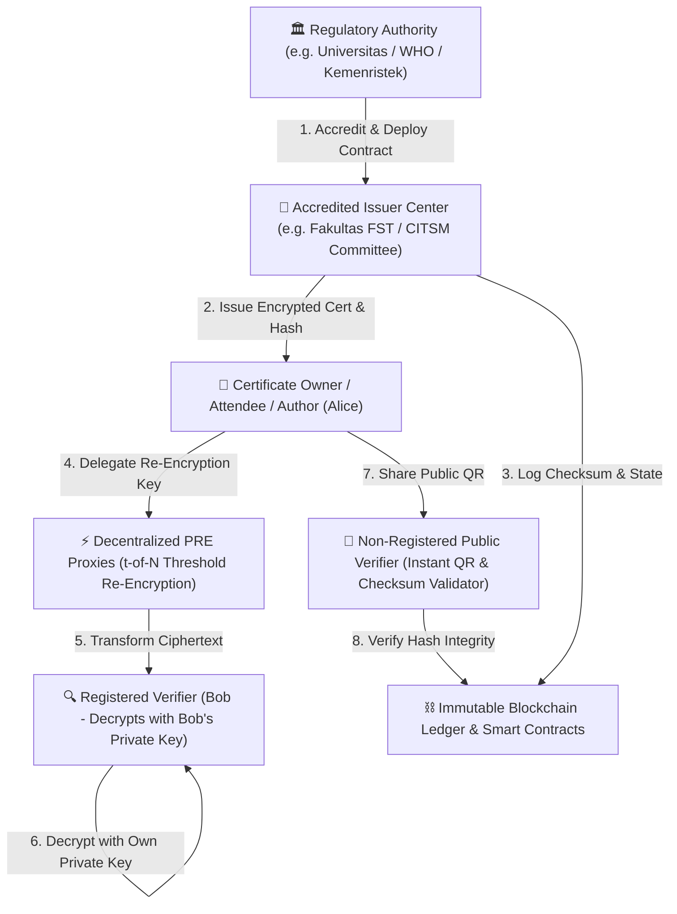
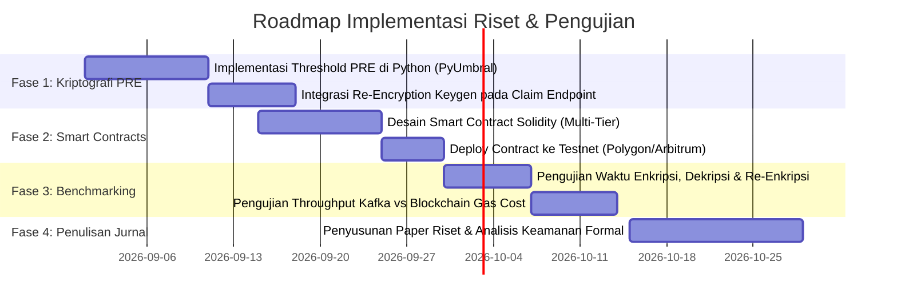

# Research Notes & Implementation Blueprint: Blockchain-Based Sovereign Digital Certificate Management

**Dokumen Analisis Riset & Arsitektur Implementasi**  
**Referensi**: *International Journal of Information Security (Springer, 2022) 21:1069–1090*  
**Judul Asli**: *"Highly private blockchain-based management system for digital COVID-19 certificates"*  
**Penulis**: Rosa Pericàs-Gornals, Macià Mut-Puigserver, M. Magdalena Payeras-Capellà (*Universitat de les Illes Balears, Spain*)  
**DOI**: [`10.1007/s10207-022-00598-3`](https://doi.org/10.1007/s10207-022-00598-3)  
**Tujuan**: Menghubungkan temuan riset Springer 2022 dengan sistem **Secure Cert Flow** untuk riset lanjutan, implementasi sistemik, pengujian benchmark, dan penulisan artikel ilmiah/jurnal.

---

## 1. Eksekutif Ringkasan Riset (Executive Summary)

Paper Springer 2022 mengusulkan protokol manajemen sertifikat digital terdesentralisasi berkeamanan tinggi yang memecahkan **tiga paradoks utama** dalam penerbitan dokumen digital:
1. **Privasi Tingkat Tinggi vs. Kebutuhan Verifikasi Publik**: Data pemilik sertifikat (data privat) harus terlindungi kerahasiaannya (*Confidentiality* & *GDPR Compliance*), namun sertifikat harus bisa diverifikasi keasliannya secara instan oleh pihak ketiga.
2. **Kedaulatan Data Pemilik (*Self-Sovereign Identity / SSI*)**: Pemilik sertifikat (bukan server terpusat) yang memegang kendali penuh atas siapa saja yang berhak melihat isi detail dokumen.
3. **Anti-Pemalsuan Mutlak (*Forgery-Proof*) & Pengawasan Otoritas Regulasi**: Mencegah penerbitan sertifikat palsu oleh pihak internal nakal melalui sistem hierarki otoritas pengatur (*Regulatory Authority*) dan *Smart Contract*.

---

## 2. Analisis Komponen Kriptografi & Protokol

### 2.1 Threshold Proxy Re-Encryption (PRE) dengan Skema $(t, N)$
Protokol ini menggunakan **Proxy Re-Encryption (PRE)** berbasis kriptografi kurva eliptik (*Elliptic Curve Cryptography*). PRE memungkinkan pihak *proxy* mengubah *ciphertext* yang dienkripsi menggunakan kunci publik Alice ($pk_A$) menjadi *ciphertext* yang dapat didekripsi menggunakan kunci privat Bob ($sk_B$), **tanpa proxy pernah mengetahui kunci privat Alice maupun isi teks asli (plaintext)**.

$$\text{Ciphertext}_A = \text{Encrypt}(pk_A, \text{Data})$$
$$\text{Re-Encryption Key } (rk_{A \to B}) = \text{ReKeyGen}(sk_A, pk_B)$$
$$\text{Ciphertext}_B = \text{ReEncrypt}(rk_{A \to B}, \text{Ciphertext}_A)$$
$$\text{Data} = \text{Decrypt}(sk_B, \text{Ciphertext}_B)$$

Untuk mencegah *collusion attack* (kolusi antara 1 proxy nakal dengan verifier), skema menggunakan model **Threshold $(t, N)$ Shamir Secret Sharing**:
* Kunci re-enkripsi dipecah menjadi $N$ fragmen kunci (*kfrags*).
* Minimal $t$ fragmen proxy harus memproses *ciphertext* untuk menghasilkan transformasi yang valid.

### 2.2 Arsitektur Multi-Tier Smart Contracts
Protokol diorganisir menjadi 3 lapis *smart contract*:
1. **`AuthorityContract`**: Dikelola oleh Otoritas Regulasi untuk mendaftarkan institusi/fakultas/komite acara yang terakreditasi dan dapat mencabut izin jika ditemukan pelanggaran (*Emergency Self-Destruct*).
2. **`CenterContract`**: Mewakili masing-masing fakultas/panitia acara untuk menerbitkan sertifikat peserta secara sah.
3. **`CertificateContract`**: Mencatat status sertifikat (AKTIF / DICABUT), hash integritas data, stempel waktu (*timestamp*), dan bukti kepemilikan.

### 2.3 Dual-Mode Verification (Verifikasi Ganda)
* **Model A (Pihak Terdaftar / Registered Verifiers)**: Untuk verifikasi mendalam antar lembaga (misal: verifikasi ijazah antar kampus/perusahaan) yang memiliki pasangan kunci kriptografi terdaftar.
* **Model B (Pihak Publik / Non-Registered Verifiers)**: Untuk verifikasi instan via QR Code & SHA-256 checksum secara publik tanpa perlu membuat akun Web3.

---

## 3. Matriks Perbandingan Komprehensif

| Parameter Evaluasi | Sertifikat Digital Tradisional (PDF/PKI Lama) | Paper Springer 2022 (Health Certs) | Secure Cert Flow (Sistem Kita Saat Ini + Roadmap Riset) |
| :--- | :--- | :--- | :--- |
| **Penyimpanan Data** | Server Database Terpusat (Rentan bocor & manipulasi) | Hybrid: Blockchain + IPFS Off-chain | Hybrid: PostgreSQL + MinIO S3 + Blockchain Hash Ledger |
| **Kerahasiaan Data** | Plaintext tersimpan di server | Proxy Re-Encryption (Alice retains 100% control) | SHA-256 Checksum + Enkripsi Dinamis On-Demand |
| **Skalabilitas Pemrosesan** | Terbatas koneksi Web Server tunggal | On-chain Gas Cost (~15 detik per block Ethereum) | Apache Kafka Distributed Queue (Ribuan sertifikat/detik) |
| **Verifikasi Publik** | Manual / Tanda Tangan Digital PDF statis | QR Code Scan & Keccak-256 On-Chain | QR Code + Hash SHA-256 + Presensi Live Geotag GPS & Wajah |
| **Dukungan Tipografi & Format** | Statis per file PDF | JSON Data Payload | Resolusi Full HD 1920x1080 + Dynamic Fonts + Auto-Scaling |
| **Regulasi Penerbit** | Admin Terpusat tunggal | Regulatory Authority Multi-Tier | Panitia Acara + Verifikasi Institusi Kampus UIN Jakarta |

---

## 4. Rencana Implementasi & Pengujian Riset (Research & Experiment Roadmap)

Untuk mempersiapkan publikasi ilmiah dan implementasi eksperimental di platform **Secure Cert Flow**:

### 4.1 Langkah-Langkah Teknis Implementasi:
1. **Modul Kriptografi `pyUmbral`**:
   * Menambahkan package `umbral` / `pyUmbral` pada backend FastAPI untuk menguji pendelegasian sertifikat antara pemilik peserta (*Alice*) dan institusi pemeriksa (*Bob*).
2. **Anchor Hash on Blockchain (Solidity Smart Contract)**:
   * Mengaitkan `checksum_sha256` dari sertifikat yang di-generate oleh `cert_generator.py` ke dalam *smart contract* berbasis EVM (Polygon PoS / Arbitrum untuk efisiensi gas fee).
3. **Pengukuran Metrik Performa (Benchmarking)**:
   * **Latency (ms)**: Waktu *Key Generation*, *Re-Encryption*, *Decryption*, dan *Rendering Image*.
   * **Throughput (TPS)**: Kapasitas penerbitan dengan antrean Kafka.
   * **Gas Cost (Gwei / USD)**: Estimasi biaya eksekusi smart contract per transaksi sertifikat.

---

## 5. Struktur Kerangka Penulisan Artikel Ilmiah (Paper Outline Draft)

Berikut struktur naskah ilmiah yang siap ditulis dan diajukan ke jurnal/konferensi bereputasi (*IEEE / Springer / Scopus*):

* **Judul yang Disarankan**:
  > *"Decentralized and Privacy-Preserving Academic Certificate Management System Using Threshold Proxy Re-Encryption and High-Throughput Stream Processing"*
* **I. Pendahuluan**:
  * Masalah pemalsuan sertifikat akademik dan seminar, isu kebocoran data pribadi (UU PDP / GDPR), serta keterbatasan verifikasi manual.
* **II. Tinjauan Pustaka (*Literature Review*)**:
  * Analisis kritis terhadap paper Springer 2022 (*Pericàs-Gornals et al.*), PKI klasik, dan sistem berbasis blockchain terkini.
* **III. Metodologi & Arsitektur Sistem Yang Diusulkan (*Proposed Architecture*)**:
  * Arsitektur integrasi FastAPI, Apache Kafka asynchronous queue, MinIO S3 storage, PIL Dynamic Typography Engine, dan Threshold PRE Layer.
* **IV. Analisis Keamanan Formal (*Security & Privacy Analysis*)**:
  * Bukti ketahanan terhadap *Sybil attack*, *Collusion attack*, *Data tampering*, dan jaminan *Forward/Backward Secrecy*.
* **V. Hasil Eksperimen & Analisis Performa (*Empirical Evaluation*)**:
  * Tabel perbandingan *execution time*, *memory consumption*, *gas cost efficiency*, dan *visual placement accuracy*.
* **VI. Kesimpulan & Arah Riset Masa Depan**.
